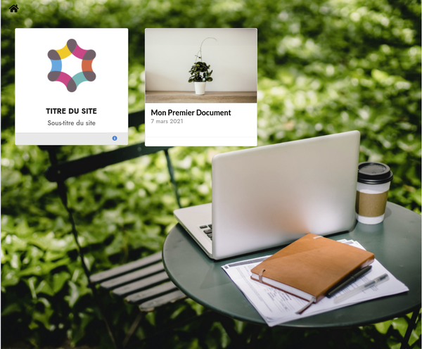

<!--more-->
# THEME HUGO - BEEDREAM

## Installation

**Beedream** est un thème pour le moteur de site web statique [Hugo](https://gohugo.io)

L'installation de Hugo est décrite sur le site [Hugo Quick Start](https://gohugo.io/getting-started/quick-start/)

La documentation complète du thème se retrouve [ici](https://www.billerot.eu/beedream/)

Résumé des commandes

    # Sous DEBIAN 10
    # Installation de Hugo (actuellement version 0.77)
    sudo apt install hugo
    hugo version
    
    Hugo Static Site Generator v0.77.0-DEV linux/amd64 BuildDate: unknown

## Création du site "quickstart"

    hugo new site quickstart

## Installation du thème "beedream" avec Git

**beedream** sera considéré comme un sous-module du project **quickstart**

	# si cela n'est pas déjà fait, installer git
    sudo apt install git
    # 
    cd quickstart
    git init
    git submodule add https://github.com/pbillerot/beedream.git themes/beedream

## Déclarer le thème

    # - Déclaration du thème
    # - éditer le fichier "config.toml"
    # - ajouter la ligne "theme beedream"
    echo 'theme = "beedream"' >> config.toml

## Créer un premier document

    hugo new site/mon-premier-document.md
    # éditer le document pour changer l'état "draft:" à false

## Démarrage et Tests
Comme précisé dans la documentation de Hugo

    hugo server

Démarrer votre navigateur avec l'adresse

- http://localhost:1313/

 

## Mise à jour du thème sur un site existant

    git submodule update --remote

## Installation du thème sur un site existant

    git submodule add https://github.com/pbillerot/beedream.git themes/beedream
    git submodule init
    git submodule update --remote

Changer `theme = "beedream"` dans `config.toml`

