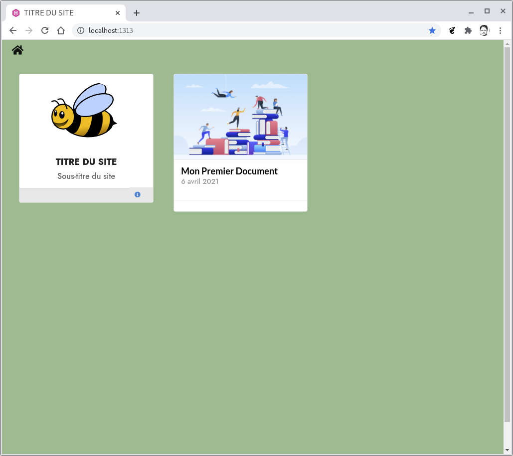

# THEME HUGO - BEEDREAM

## Installation
L'installation est décrite sur le site [gohugo.io](https://gohugo.io)
- https://gohugo.io/getting-started/quick-start/

Résumé des commandes
```shell
# Sous DEBIAN 10
# - Installation de Hugo
sudo apt install hugo

# Création du site "quickstart"
hugo new site quickstart

# - Installation du thème "beedream"
cd quickstart
git init
git submodule add https://github.com/pbillerot/beedream.git themes/beedream
# - Déclaration du thème
# - éditer le fichier "config.toml"
# - ajouter la ligne "theme beedream"
echo 'theme = "beedream"' >> config.toml
```

## Créer un premier document
```shell
hugo new site/mon-premier-document.md
# éditer le document pour changer l'état "draft:" à false
```

## Démarrage et Tests
Comme précisé dans la documentation de Hugo
```shell
hugo server
```
Démarrer votre navigateur avec l'adresse
- http://localhost:1313/



## Mise à jour du thème sur un site existant
    git submodule update --remote

## Installation du thème sur un site existant
    git submodule add https://github.com/pbillerot/beedream.git themes/beedream
    git submodule init
    git submodule update --remote

Changer `theme = "beedream"` dans `config.toml`

